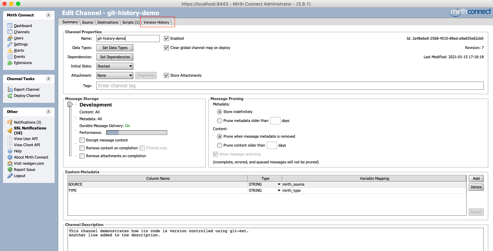
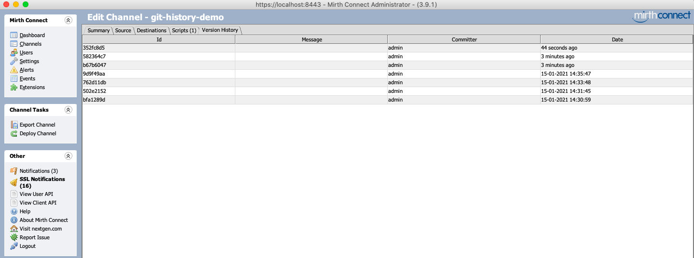
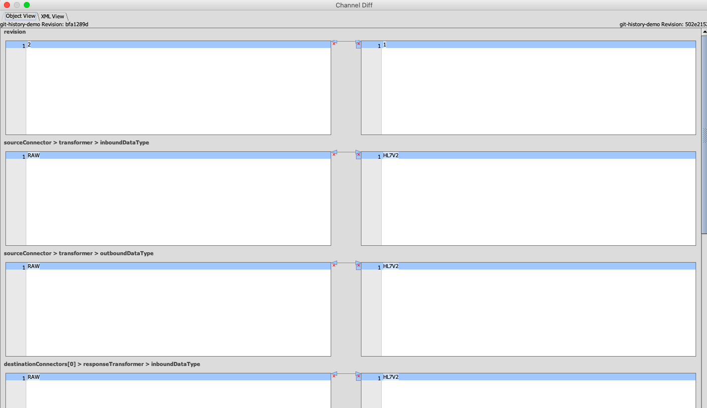
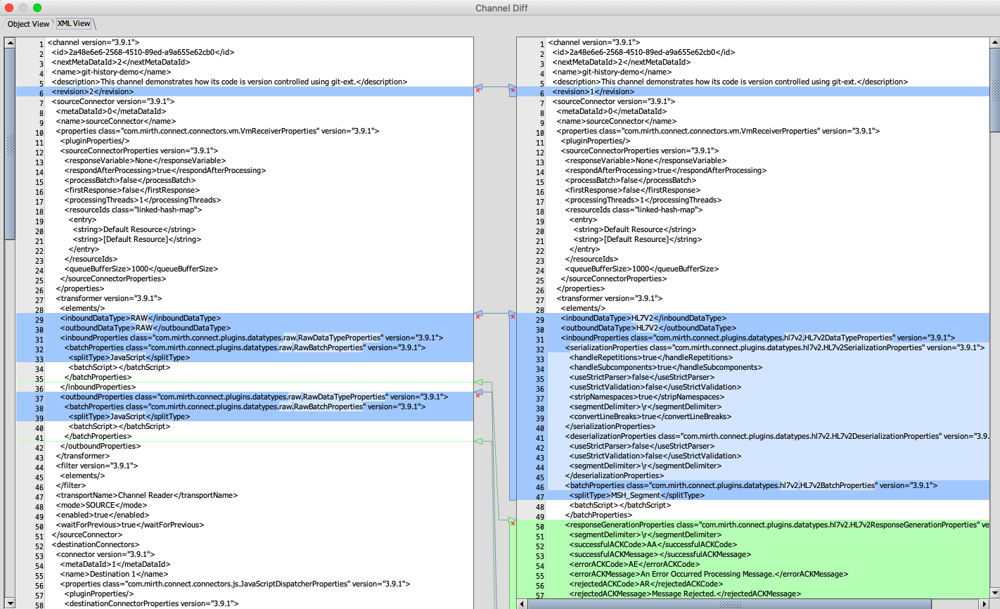

# Git Extension
This is a MirthConnect extension for version controlling Channels and CodeTemplates.
Git is used as the VCS on the serverside using JGit.

# Building
This project depends on [Objmeld](https://github.com/kayyagari/objmeld) project for creating visual diffs and it should be built first. Its source is not included here due
to licensing issues (The project JMeld from which Objmeld was derived was released under LGPL).

Another caveat is that various libraries of MirthConnect distribution must be present in your Maven repo (local or remote).

Once the above are taken care of then run `mvn clean install` to build the extenstion. The final artifact will be present under
`package/target` folder with the name `git-ext-<version>.zip`.  

# Notes
- When using this plugin in a Docker deployment, set `XDG_CONFIG_HOME` environment variable to `/opt/connect`. This ensures JGit writes it's config to Connect working dir so mirth user can create the necessary dirtree. [SO answer](https://stackoverflow.com/a/65735434/2154297)

# Screenshots
##### 1. Version history tab added to the channel editor

##### 2. Version history data

##### 3. Object diff view

##### 4. XML diff view

